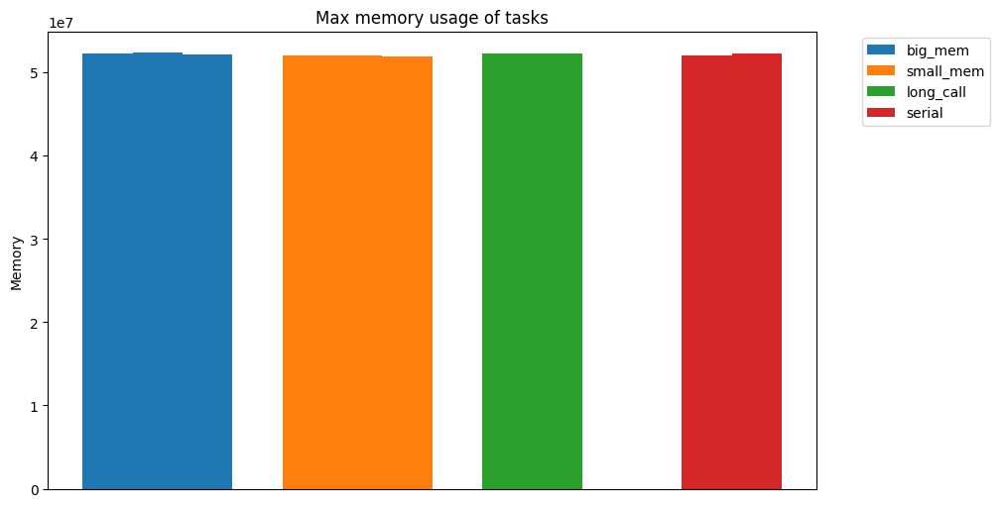

Bear
==========

**bear** is a package for running tasks asynchronously and in parallel in
such as way that you can actually use the cpu cores. `bear` can also
be used as a pipeline where you can monitor tasks durations and memory
usage and plot them. The purpose of this package is to run tasks in other processes in parallel using synchronous or asynchronous patterns.

#Installation
How to install:
`pip install bear`


#Parallel Processing (Single Server)
The example below illustrates how you can create a "task" from a python function and execute it in a separate process and get the result from it.
```python
from bear import Task

def add(a, b):
    return a + b

if __name__ == '__main__':
    task = Task(add)
    task.start(args=[1, 2])
    print('Result:', task.get_result())
    print(task.get_stats())
```

```shell
Result: 3
{'id': '111bf859-d532-4380-8d91-92e18c4dc4b7', 'start': '11:44:21', 'end': '11:44:27', 'duration': 5.641399, 'max_mem': 52314112}
```

On Windows operating systems, please make sure you call these from the __main__ section because python requires subprocesses to be inside the __main__ on windows.
Moreover, making operation parallel with multi-processing is beneficial if the process is long. As you can see, there is an over-head for spawing new processes. 
Regarding get_stats(), note that calling it before get_result(), it will not give you the correct duration since the process is still running.

Another example:
Run 3 tasks in parallel and wait for all to finish:
```python
from bear import parallel


def calculate(a, b, c=2):
    return (a + b) / c


if __name__ == '__main__':
    tasks = parallel(calculate, [(1, 2), (2, 3), (5, 5)], c=5)
    print([task.get_result() for task in tasks])

```

```shell
INFO:bear:Task 7770b18b-78d0-488f-94c3-6700ab82af9a PID: 10128 is running calculate(1, 2), keywords:{'c': 5}
INFO:bear:Task 750b9268-05fc-493f-9bd0-fd21e4d9dec7 PID: 15484 is running calculate(2, 3), keywords:{'c': 5}
INFO:bear:Task 7c791cf2-8899-45b7-b0d5-660c72605a20 PID: 19328 is running calculate(5, 5), keywords:{'c': 5}
INFO:bear:Task 7770b18b-78d0-488f-94c3-6700ab82af9a calculate succeeded after 2 seconds.
INFO:bear:Task 750b9268-05fc-493f-9bd0-fd21e4d9dec7 calculate succeeded after 2 seconds.
INFO:bear:Task 7c791cf2-8899-45b7-b0d5-660c72605a20 calculate succeeded after 3 seconds.
[0.6, 1.0, 2.0]
```

If you want to use different keyword arguments, here is an example of that:
```python
from bear import parallel


def calculate(a, b, c=2):
    return (a + b) / c


if __name__ == '__main__':
    tasks = parallel(calculate, [(1, 2), (2, 3), (5, 5)], kwargs=[{'c': 5}, {'c': 50}, {'c': 500}])
    print([task.get_result() for task in tasks])

```

#Pipeline
Here is an example for using bear as a pipeline:
```python
from bear import Pipeline


def div(a, b):
    return a / b


if __name__ == '__main__':
    pipe = Pipeline()
    results = pipe.parallel_sync(div, [(1, 1), (1, 9)])
    print(results)

```

```shell
INFO:bear:Task c67d4e18-2eae-4c42-9b3f-6fba994b2933 PID: 19172 is running div(1, 1), keywords:{}
INFO:bear:Task 415ce2b3-5474-4d0c-a3e7-2f62df77da23 PID: 10380 is running div(1, 9), keywords:{}
INFO:bear:Task c67d4e18-2eae-4c42-9b3f-6fba994b2933 div succeeded after 16 seconds.
INFO:bear:Task 415ce2b3-5474-4d0c-a3e7-2f62df77da23 div succeeded after 16 seconds.
[1.0, 0.1111111111111111]
```
#Synchronous versus Asynchronous
You can make use of asynchronous executions and use the `wait()` method to synchronize the as shown below:
```python
import os
from bear.pipeline import Pipeline
from time import sleep
import tempfile
import random


def big_mem(num_of_bytes, count):
    arr = []
    for _ in range(count):
        arr.append(random.randbytes(num_of_bytes))
        sleep(0.1)
    return ''


def small_mem(count):
    arr = []
    for _ in range(count):
        arr.append(random.randint(1, 100))
        sleep(0.1)
    return ''


def long_call(count):
    for _ in range(count):
        sleep(0.1)
    return ''


def serial(num_of_bytes, count):
    arr = []
    for _ in range(count):
        arr.append(random.randbytes(num_of_bytes))
        sleep(0.1)
    return ''


if __name__ == '__main__':
    pipe = Pipeline(memory_monitor_interval=1)
    pipe.parallel_async(big_mem, [[5000, 20], [2000, 18], [4000, 14]])
    pipe.parallel_async(small_mem, [[12], [14], [16]])
    pipe.parallel_async(long_call, [[30], [25]])
    pipe.wait()
    pipe.parallel_sync(serial, [[2000, 13], [4000, 10]])

    dir_path = None
    with tempfile.NamedTemporaryFile() as tf:
        dir_path = os.path.dirname(tf.name)

    pipe.plot_tasks_duration(os.path.join(dir_path, 'duration.png'))
    pipe.plot_tasks_memory(os.path.join(dir_path, 'task_memory.png'))
    pipe.plot_system_memory(os.path.join(dir_path, 'system_memory.png'))
    pipe.save_stats(os.path.join(dir_path, 'stats.json'))
    print('Saved to: ', dir_path)

```

You can also see in the example above that we plotted the statistics of the pipeline execution.
Here are the generated plots:





Note in the last plot that the tasks labeled as "serial" are run synchronously after waiting for the other asynchronous tasks.

